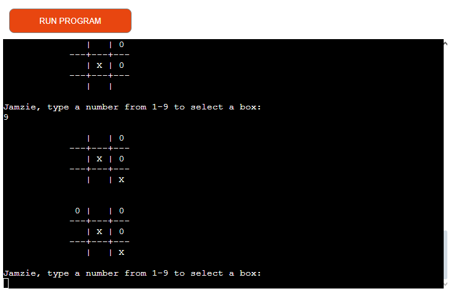
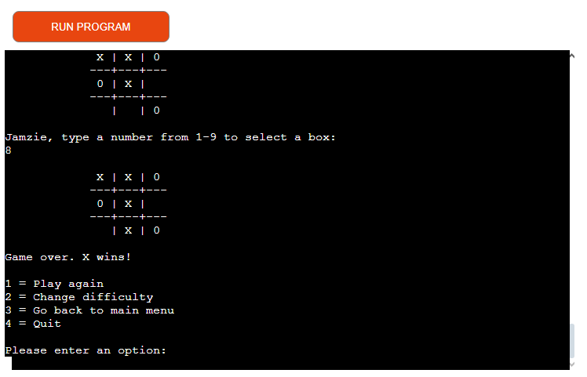
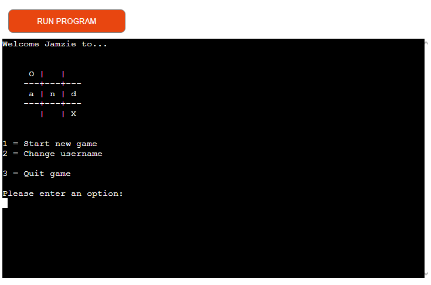
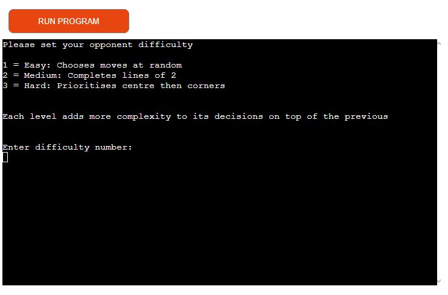
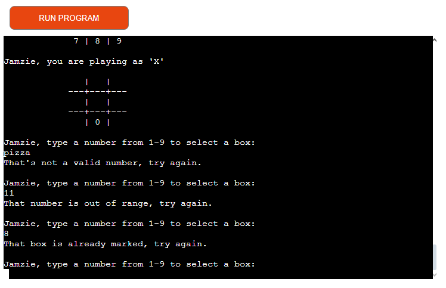

# [O and X](https://oandx-11a385ee261b.herokuapp.com "Click to view deployed site")

O and X is a Python terminal game, which runs on the Code Institute mock terminal in Heroku.

Users can try to beat the computer by getting 3 symbols in a row on the 3 x 3 game board before it does. 

## How to Play

O and X is based on the the classic pen and paper game 'Noughts and Crosses' (or 'Tic-Tac-Toe'). You can read more about it on [Wikipedia](https://en.wikipedia.org/wiki/Tic-tac-toe).

In this version, the user enters a username and chooses a computer difficulty.

The user (playing as 'X') and computer (playing as 'O') take turns placing their symbol on a free location on the board. Who goes first is determined at random.

The winner is the player who gets 3 of their symbol in a row first. If all spaces on the board are filled and neither player has won, it is a tie. 

## Features

### Existing Features

#### Username Input and Sanitisation

- The user starts the program by setting a username
- This is then stripped of leading and trailing spaces
- The end result is finally required to be between 3 and 15 characters

#### Main Menu

- The user is then welcomed to the game and shown the game logo
- They are then shown options of what to do next including:
  - Start new game
  - Change username
  - Quit game

#### Multiple Difficulty levels

- The user is able to choose how hard the computer is to play against
- These levels are:
  - Easy: Chooses moves at random
  - Medium: Completes or blocks lines of 2
  - Hard: Prioritises centre then corners
- Each level adds more complexity to its decisions on top of the previous

#### Input validation and Error Checking

- You must enter a number
- You cannot enter a number outside of expected values
- You cannot enter a box number that is already taken

### Future Features

- Difficulty level 4: Perfect play using a Minimax algorithm
- Allow player to quit out of the current game at any point
- Change the datamodel to use a class
- Keep score against computer
- Record games in google sheets for later analysis

## Data Model

I decided to use a one-dimensional array to represent the board. This was a choice made by the author of the original code I based my design on. 

This code only picked computer moves at random. I implemented my additional difficulty levels and randomising the starting player on top of it, as well as fixing some bugs and tidying some functions.

## Testing

I have manually tested the project by doing the following:

- Tested all input validation:
  - Strings where number are expected
  - Out of bounds moves
  - Attempting to select an already filled box
  - Illegal usernames
  - Incorrect menu selections
- Tested in my local terminal and the Code Institute Heroku Terminal

### Bugs

#### Solved Bugs

Fixed Null return from potential win function. Done by handling the case where it does not find a winning or blocking move.

Fixed NoneType error within original code from kedmundson. Done by fixing syntax error. 

### Unfixed Bugs

No bugs remaining

### Validator Testing

I passed the code through PEP8 and confirmed there are no issues

## Deployment

This project was deployed using Code Institute's mock terminal for Heroku

- Steps for deployment
  - Fork or clone this repository
  - Create a new Heroku app
  - Set the buildbacks to Python and NodeJS
  - Link the Heroku app to the repository
  - Click on **Deploy**

## Credits

### Content

Game code based on 'Human vs. Computer Tic Tac Toe' by kedmundson
- https://gist.github.com/kedmundson/58cddc51af1835166b6e

Clear screen in Python using `clear` from geeksforgeeks.org
- https://www.geeksforgeeks.org/clear-screen-python/

Code Institute for the deployment terminal

### Information Sources

Wikipedia for rules and strategies of Naughts and Crosses (Tic-Tac-Toe)
- https://en.wikipedia.org/wiki/Tic-tac-toe#Strategy

### Testing

PEP8 for compliance testing
- https://pep8ci.herokuapp.com/#